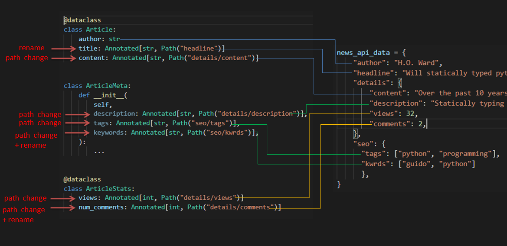

# DictGest - Python Dictionary Ingestion

[](https://codecov.io/gh/bmsan/dictgest)
[](https://github.com/bmsan/dictgest/actions?queryworkflow%3ACI+event%3Apush+branch%3Amain)

# Description

When interacting with external REST APIs or with external configuration files we usually do not have control 
over the received data structure/format.

`DictGest` makes ingesting dictionary data into python objects(dataclasss objects included) easy when the dictionary data doesn't match 1 to 1 with the Python class:
  - The dictionary might have extra fields that are of no interest
  - The keys names in the dictionary do not match the class attribute names
  - The structure of nested dictionaries does not match the class structure
  - The data types in the dictionary do not match data types of the target class

# Examples

## Trivial Example
The first most basic and trivial example is ingesting a dictionary that has extra data not of interest


```python
car = from_dict(Car, dict_data)
```

## Example 2: Data mapping renaming & rerouting


The full working example can be found in the [examples folder](examples/news_example.py)
```python


  'year': 2022
  'color': 'red',
  'steering_side': 'right',
  'completed_by': 'H.O. Ward',
  'completed_at': '2022/02/02'
})
            }

class Car:
    def __init__(self, 
                name, 
                year,
                color, 
                num_seats=4, 
                steering_side='left'):
        ...

@dataclass
class Car:
  name: str
  year: int
  color: str
  num_seats:int=4
  steering_size:str='left'


car = from_dict(Car, dict_data)


// Location Mapping

@typecheck
@typecast
@dataclass
class ArticleV3:
  # This will be extracted from the author field
  author: str
  # headline renamed to title
  title:  Annotated[str, Path('headline')]  
  # different path + rename
  description: Annotated[str, Path('content/shortVersion')]
  # Transform the data 
  total_votes: Annotated[str, Path('stats', extractor=compute_votes)]


def compute_votes(stats: dict):
  return stats['pozitive_votes'] + stats['negative_votes']


....
@typeconvert

````